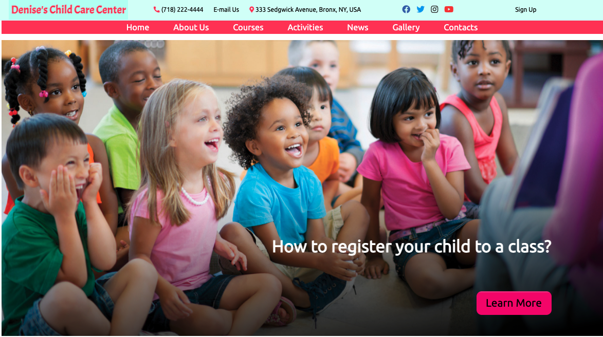
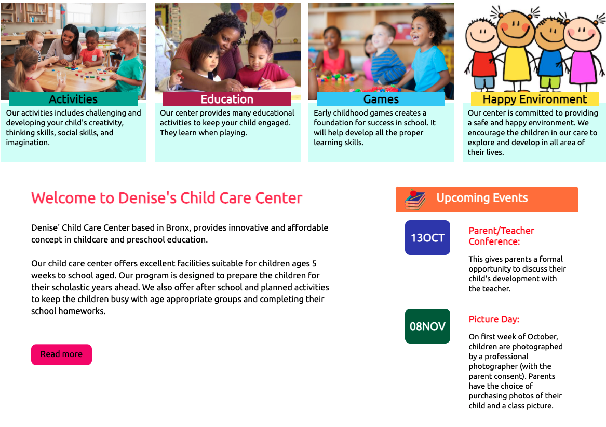
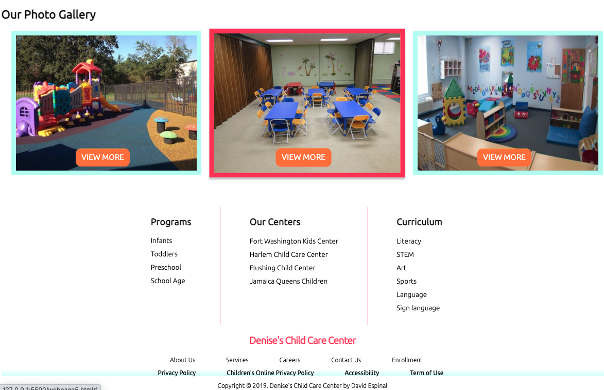

# Denise's Child Care Center

## Description

Denise's Child Care Center is a single page web application with unique design inspired by Dribbble. The content introduced in this web page is rendererd with a beaufiful color combination, making it easier for users to read the content. The web page shows a headline for users to learn more about the child care center. Below the headline there is a section for users to read about the activities, education, games and environment provided by the center. Denise's Child Care Center web page have a calendar for users to stay infom about the upcoming events happening at the center. This web application is responsive to desktop, tablet, and mobile device.

## User Interface

### Homepage is divided into these sections: Headline, Program, Mission Statement, Calendar, and Photo Gallery.

- The header contains nav links to different pages (for this project these links re-direct to the home page), and a headline where users have the option to learn more on registering a child into the child care center.
- User may hover and click on the programs provided by the child center. Clicking any of the program may potentially redirect a user to another page with more information about the selected program. Also, user may read about the upcoming events by reading the content posted on the calendar.
- The photo gallery selection has three images for users to click on these images and potentially be directed to another page where they get to see more about the child center.

- Denise's Child Care Center application was developed using HTML, CSS and Javascript
- CSS flexbox was implemented to lay out the content neatly on the web application
- This web page is responsive on three different screen sizes: desktop, mobile, and tablet. Application will be hosted on Github.

## Inspiration 
There has been been a growth in the number of child care centers develop in NYC. I wanted to create and design (inspired by the arts posted in Dribbble) a web page where I can help users gain information about the child care center of their interest. 

##### Disclaimer: I do not own the rights to any of the images included in this respository. All images were pulled from Google searches.